# 🛒 Shopping Frontend

상품 탐색, 장바구니, 회원/비회원 주문, 마이페이지, 관리자 운영 화면을 구현한 쇼핑몰 프론트엔드 프로젝트입니다.

이 프로젝트는 단순히 상품 목록과 장바구니 화면을 만드는 것보다, 실제 쇼핑몰 운영에서 필요한 **인증 흐름, 주문 생성, 비회원 주문, 입금 확인, 배송 처리, 반품 승인/거절, 관리자 처리 과정**을 프론트엔드에서 일관되게 다루는 것에 중점을 두었습니다.

API 연동 과정에서 요청/응답 구조, 인증 방식, 주문 payload 기준이 명확해야 화면 흐름이 안정적으로 동작한다는 점을 확인했습니다.

이후 API 요청 계층과 인증 만료 처리 흐름을 분리하며, 화면 코드는 렌더링과 사용자 액션에 집중하고 API 요청, 인증, 에러 처리는 공통 계층에서 관리하도록 구조를 정리했습니다.

---

## 🧰 Tech Stack

| 구분 | 기술 |
| --- | --- |
| Framework | React |
| Language | JavaScript |
| Routing | React Router |
| API | Axios |
| Styling | Tailwind CSS |
| Auth | JWT Access Token + Refresh Token Cookie |
| State | Context API, localStorage |
| UI | React Icons, React Toastify |
| Test | React Testing Library |
| Performance | web-vitals |
| Build | React Scripts |

---

## ✨ 주요 기능

### 👤 사용자 기능

- 회원가입 / 로그인 / 로그아웃
- 비회원 주문
- 상품 목록 조회
- 상품 상세 조회
- 옵션 선택
- 장바구니
- 선택 결제 / 전체 결제
- 회원 주문 / 비회원 주문
- 체크아웃
- 주문 생성
- 주문 내역 조회
- 반품 요청
- QnA 작성 / 조회
- 공지 / FAQ 조회
- 마이페이지

### 🛠️ 관리자 기능

- 상품 등록 / 수정 / 삭제
- 이미지 업로드
- 주문 목록 조회
- 입금 확인
- 배송 처리
- 반품 승인 / 거절
- 공지 / FAQ 관리

---

## 🖼️ 주요 화면

### 🛍️ 상품 탐색

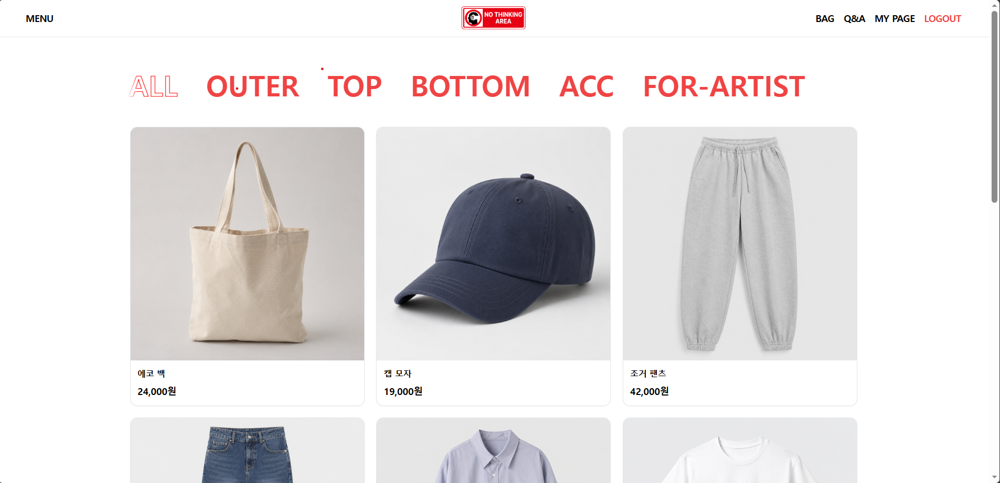

사용자는 상품 목록에서 상품을 탐색하고, 상세 페이지로 이동할 수 있습니다.

상품 목록 화면에서는 상품 카드, 가격, 상품 정보, 상세 페이지 이동 흐름을 제공합니다.

---

### 🛒 장바구니

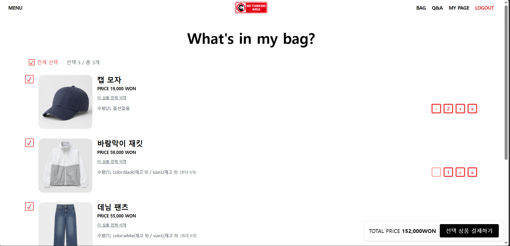

장바구니에서는 사용자가 담은 상품의 옵션, 수량, 가격을 확인할 수 있습니다.

장바구니 데이터는 주문 요청으로 이어지기 전 단계이므로, 사용자가 선택한 옵션 정보와 수량을 주문 payload로 변환할 수 있는 형태로 관리했습니다.

---

### ✅ 회원 주문 / 체크아웃

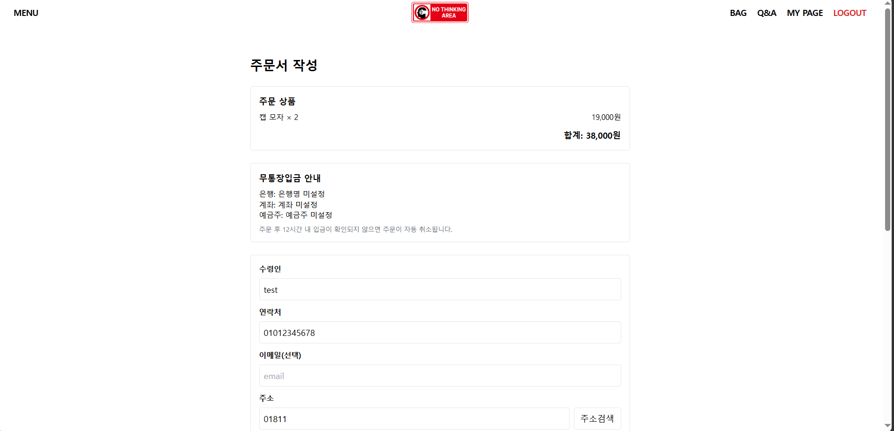

로그인 사용자는 계정 정보를 기준으로 주문할 수 있습니다.

체크아웃 화면에서는 장바구니 아이템을 주문 요청 payload로 변환해 서버에 전달합니다. 프론트엔드는 사용자가 선택한 상품과 옵션 정보를 주문 요청 형태로 정리하고, 서버는 옵션 조합과 재고 검증을 최종 책임으로 갖도록 흐름을 나누었습니다.

---

### 🧾 비회원 주문 / 체크아웃

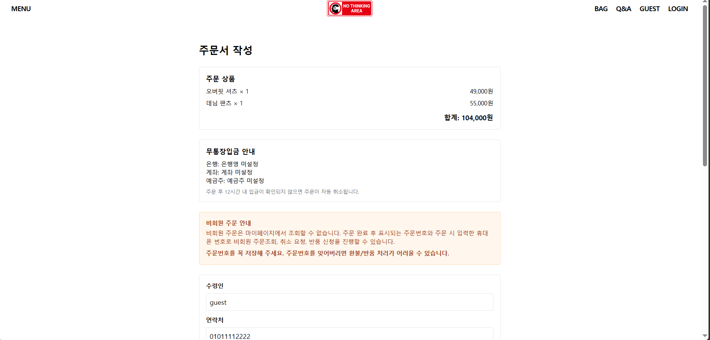

비로그인 사용자도 상품을 장바구니에 담고 주문할 수 있도록 비회원 주문 흐름을 구현했습니다.

로그인 사용자는 계정 정보를 기준으로 주문을 생성하고, 비로그인 사용자는 체크아웃 화면에서 주문자 정보와 배송 정보를 입력해 주문할 수 있도록 분리했습니다.

이를 통해 로그인하지 않은 사용자도 상품 탐색, 장바구니, 체크아웃, 주문 생성까지 이어지는 흐름을 사용할 수 있게 했습니다.

---

### 📦 관리자 주문 관리

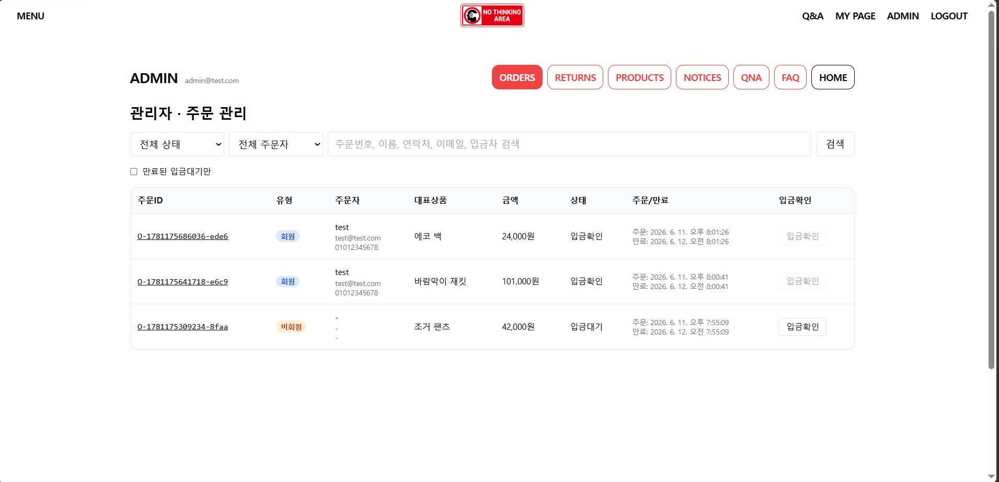

관리자는 주문 목록을 확인하고, 입금 확인과 배송 처리 같은 주문 운영 상태를 관리할 수 있습니다.

주문 관리는 단순 목록 조회가 아니라, 실제 쇼핑몰 운영에서 반복적으로 발생하는 상태 변경 흐름이기 때문에 관리자 화면에서 명확하게 구분되도록 구성했습니다.

---

### 🔁 관리자 반품 관리

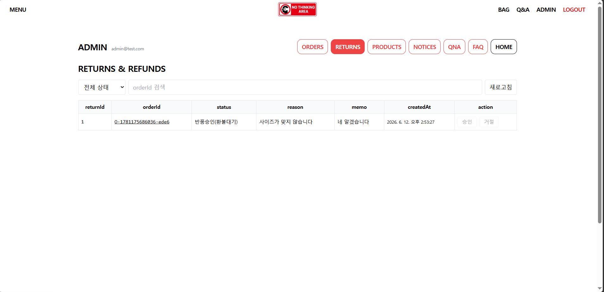

관리자는 사용자가 요청한 반품 내역을 확인하고, 반품 승인 또는 거절 처리를 할 수 있습니다.

반품은 주문 이후의 운영 흐름이므로, 주문 관리와 별도의 탭으로 분리해 운영자가 처리해야 할 상태를 빠르게 확인할 수 있도록 구성했습니다.

---

### 🔐 로그인 모달

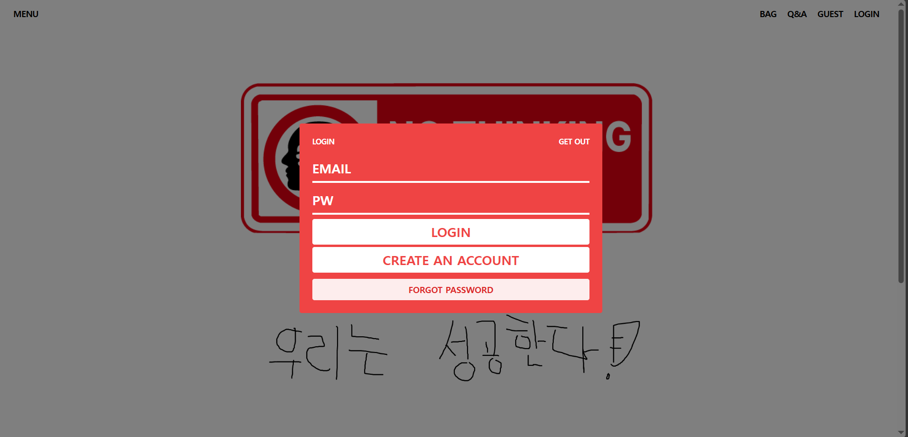

인증이 필요한 기능에서 인증이 만료되면 전역 인증 필요 이벤트를 발생시키고, 현재 화면 위에 로그인 모달을 표시하도록 구성했습니다.

이를 통해 각 페이지에서 인증 만료 상황을 개별적으로 처리하지 않고, 공통 흐름으로 로그인 유도를 처리할 수 있도록 했습니다.

단, 비회원 주문처럼 로그인 없이 허용한 흐름은 별도로 분기해 처리했습니다.

---

### 🧩 관리자 상품 등록 / 수정

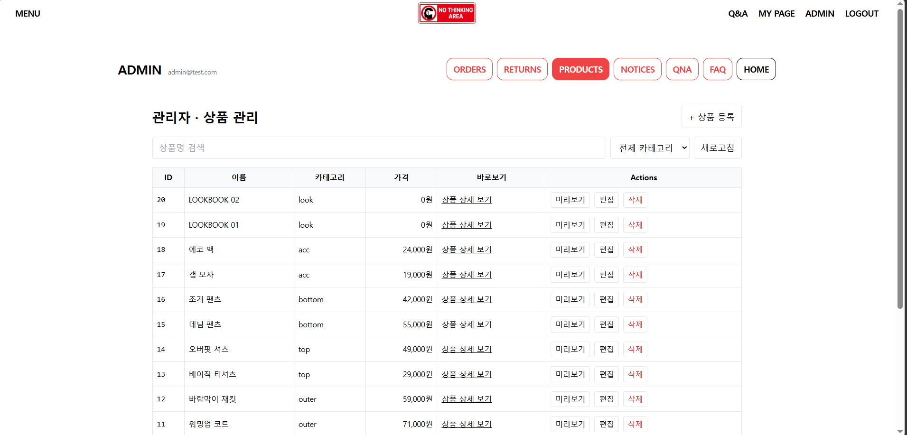

관리자는 상품 정보와 이미지를 등록하거나 수정할 수 있습니다.

사용자 화면에서 보여지는 상품 정보가 관리자 화면에서 관리될 수 있도록 상품 등록, 수정, 삭제 흐름을 분리했습니다.

---

## 📌 핵심 문제

초기 쇼핑몰 프로젝트에서는 화면 구현에 먼저 집중했습니다.

하지만 쇼핑몰은 상품 목록뿐 아니라 옵션 조합, 주문, 재고 검증, 배송, 반품, 관리자 처리처럼 화면 뒤의 운영 정책이 중요한 서비스였습니다.

API endpoint, JSON 응답 형식, 인증 방식, 주문 payload가 명확하지 않은 상태에서 프론트엔드와 백엔드가 각각 구현되다 보니 실제 연동 단계에서 데이터 구조가 맞지 않는 문제가 발생했습니다.

그래서 이 프로젝트에서는 **API 연동 문제를 줄이기 위해 요청 책임과 인증 흐름을 어떻게 분리할 것인가**를 핵심 문제로 잡았습니다.

---

## 🧱 API 요청 구조

페이지와 컴포넌트에서 직접 Axios를 호출하지 않고, 도메인별 service 함수가 공통 `request()`를 호출하도록 분리했습니다.

`request()`는 API 요청의 단일 진입점으로, body/params 전달 방식과 응답 데이터 추출을 담당합니다.

실제 Axios 인스턴스인 `httpClient`에서는 baseURL, `withCredentials`, Access Token 자동 부착, 401 공통 처리를 관리했습니다.

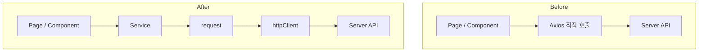

이 구조를 통해 페이지 코드는 화면 상태와 렌더링에 집중하고, 인증/응답/에러 처리 같은 공통 로직은 API 계층에서 일관되게 처리할 수 있도록 했습니다.

---

## 🔐 인증 / 세션 관리

Access Token은 프론트 메모리에만 저장하고, Refresh Token은 HttpOnly Cookie로 관리했습니다.

- Access Token: `tokenMemory`
- Refresh Token: HttpOnly Cookie
- 모든 요청은 `withCredentials: true` 기준으로 동작
- 앱 최초 진입 시 Access Token이 없으면 `/auth/refresh`를 1회 시도
- 일반 API 요청 중 401 발생 시 자동 refresh/retry를 수행하지 않음

```text
Access Token → 프론트 메모리
Refresh Token → HttpOnly Cookie
```

Access Token 저장 방식으로 `localStorage`와 메모리 저장 방식을 비교했습니다.

`localStorage`는 새로고침 이후 유지가 쉽지만 XSS 상황에서 노출 위험이 있다고 판단했습니다.

그래서 Access Token은 메모리에서 관리하고, Refresh Token은 HttpOnly Cookie 기준으로 관리하는 방향으로 정리했습니다.

---

## 🚨 401 인증 만료 처리

일반 API 요청 중 401이 발생하면 Access Token을 제거하고, 전역 `AUTH_REQUIRED` 이벤트를 발생시킵니다.

`AuthContext`는 해당 이벤트를 감지해 `authRequired` 상태를 `true`로 변경하고, `HeaderUnified`는 `authRequired` 상태를 감지해 현재 화면 위에 로그인 모달을 표시합니다.

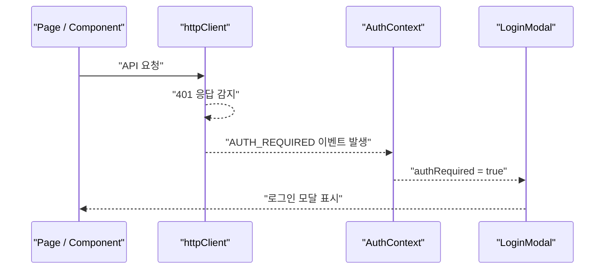

로그인 성공 시에는 사용자 정보를 다시 불러오고, `authRequired` 상태를 `false`로 초기화합니다.

이 방식은 일반 API 요청 중 401이 발생했을 때 자동 refresh/retry를 반복하지 않도록 하기 위해 선택했습니다.

무한 재시도나 예측하기 어려운 인증 상태를 줄이고, 사용자에게 명확하게 로그인 필요 상태를 안내하는 것을 우선했습니다.

---

## 🛒 장바구니 로컬 상태 관리

장바구니는 서버 API가 아니라 localStorage 기반 로컬 상태로 관리했습니다.

- 로그인 사용자: `cart_{username}`
- 비로그인 사용자: `cart_guest`
- 동일 상품이라도 옵션 조합이 다르면 별도 라인으로 저장

```text
12
12|color=black&size=M
```

장바구니는 주문 생성 전 사용자가 선택한 상품과 옵션을 임시로 보관하는 영역입니다.

따라서 서버 주문이 생성되기 전까지는 localStorage 기준으로 관리하고, 체크아웃 단계에서 주문 payload로 변환했습니다.

---

## 🧾 회원 / 비회원 주문 흐름

장바구니 아이템을 주문 payload로 변환해 서버에 전달했습니다.

로그인 사용자는 계정 정보를 기준으로 주문을 생성하고, 비로그인 사용자는 체크아웃 화면에서 입력한 주문자 정보와 배송 정보를 기준으로 주문을 생성하도록 흐름을 분리했습니다.

- 로그인 사용자: 계정 정보 기준 주문 생성
- 비로그인 사용자: 주문자 정보 / 배송 정보 입력 후 주문 생성
- `optionId`, `variantId`는 프론트에서 보내지 않음
- `optionValues` 기준으로 주문 생성
- 서버가 옵션 조합과 재고를 검증

```json
{
  "items": [
    {
      "productId": 1,
      "qty": 2,
      "optionValues": {
        "size": "M",
        "color": "black"
      }
    }
  ]
}
```

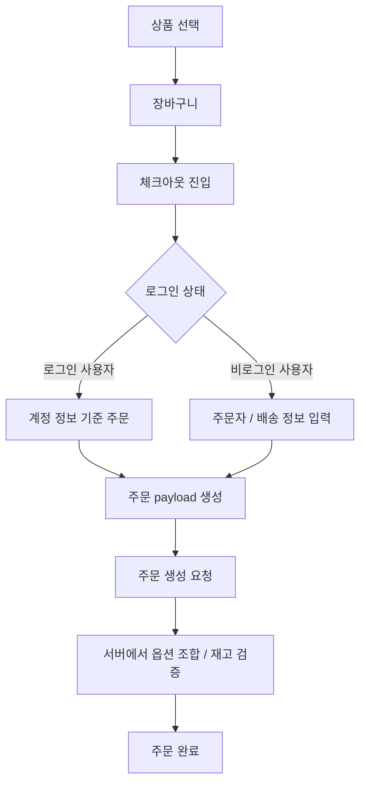

프론트엔드는 사용자가 선택한 상품, 옵션, 수량을 주문 요청 형태로 정리하고, 서버는 실제 옵션 조합과 재고 가능 여부를 검증하는 역할로 나누었습니다.

---

## 🛠️ 관리자 운영 흐름

운영자가 DB를 직접 수정하지 않고 관리자 화면에서 상품, 주문, 반품 상태를 처리할 수 있도록 구성했습니다.

- 상품 등록 / 수정
- 이미지 업로드
- 주문 목록 조회
- 입금 확인
- 배송 처리
- 반품 승인 / 거절


관리자 화면은 단순 CRUD보다 운영자가 현재 상태를 빠르게 파악하고 처리할 수 있는 흐름이 중요하다고 판단했습니다.

그래서 주문 관리와 반품 관리를 분리하고, 상태 확인과 처리 버튼이 운영 흐름에 맞게 보이도록 구성했습니다.

---

## 🧪 Troubleshooting / Lessons Learned

### 1. 화면 먼저 구현했을 때 API 연동 문제가 커지는 문제

| 항목 | 내용 |
| --- | --- |
| Problem | API endpoint, JSON 응답 형식, 인증 방식, 주문 payload가 명확하지 않은 상태에서 화면 구현을 먼저 진행해 실제 연동 단계에서 데이터 구조가 맞지 않았습니다. |
| Cause | 프론트엔드와 백엔드가 기대하는 요청/응답 형식, 인증 흐름, 주문 payload 기준이 달랐습니다. |
| Fix | `service → request → httpClient` 구조로 API 요청 계층을 분리하고, 인증/에러 처리 책임을 공통화했습니다. |
| Result | 화면 코드는 렌더링과 사용자 액션에 집중하고, API 요청/인증/응답 처리는 공통 계층에서 관리할 수 있게 되었습니다. |

### 2. 비회원 주문 흐름을 추가하며 주문 책임이 모호해지는 문제

| 항목 | 내용 |
| --- | --- |
| Problem | 로그인 사용자와 비로그인 사용자의 주문 흐름이 달라, 주문 payload에 어떤 정보를 포함해야 하는지 기준이 필요했습니다. |
| Cause | 로그인 사용자는 계정 정보가 있지만, 비로그인 사용자는 체크아웃 단계에서 주문자 정보와 배송 정보를 직접 입력해야 했습니다. |
| Fix | 로그인 상태에 따라 주문 흐름을 분기하고, 비로그인 사용자는 체크아웃 입력값을 기준으로 주문 payload를 구성하도록 정리했습니다. |
| Result | 로그인하지 않은 사용자도 장바구니에서 주문까지 이어질 수 있고, 주문 생성 전 필요한 정보가 체크아웃 화면에서 명확히 수집되도록 했습니다. |

---

## 📁 프로젝트 구조

```text
src
├─ app
│
├─ shared
│  └─ api
│     ├─ authEvents
│     ├─ httpClient
│     ├─ request
│     └─ tokenMemory
│
├─ context
│
├─ features
│  ├─ auth
│  ├─ catalog
│  ├─ cart
│  ├─ checkout
│  ├─ mypage
│  ├─ qna
│  └─ admin
│
└─ ui
   └─ components
      ├─ HeaderUnified
      └─ LoginModal
```

```text
docs
└─ screens
   ├─ product-list.png
   ├─ cart.png
   ├─ checkout.png
   ├─ guest-checkout.png
   ├─ admin-orders.png
   ├─ admin-returns.png
   ├─ login-modal.png
   └─ admin-product-form.png
```

---

## 🔧 환경 변수

```env
REACT_APP_API_BASE=https://shopping-backend-2yx6.onrender.com
REACT_APP_API_PREFIX=/api/v1
```

운영 환경에서는 `localhost` API 주소를 사용하지 않습니다.

---

## 🚀 실행 방법

```bash
npm install
npm start
```

---

## 📦 Build

```bash
npm run build
```

---

## 🧪 Test

```bash
npm test
```

현재는 테스트 도구 기반이 포함되어 있으며, 이후 사용자 행동 기반 테스트와 API 응답 상태별 UI 테스트를 보완할 계획입니다.

---


## 개선 예정

- 주문/반품 관리자 테이블의 필터와 상태 요약 UI 개선
- 인증 만료, 비회원 주문, 주문 상태별 UI 테스트 보완
- Web Vitals 기반 초기 로딩과 사용자 입력 반응성 확인
