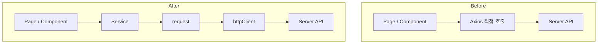
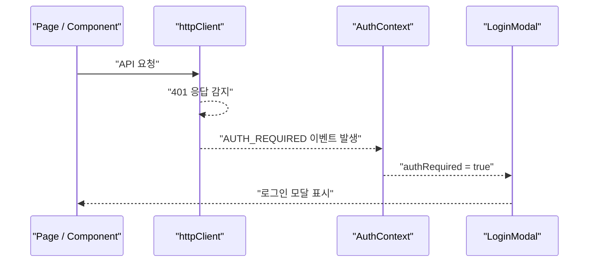
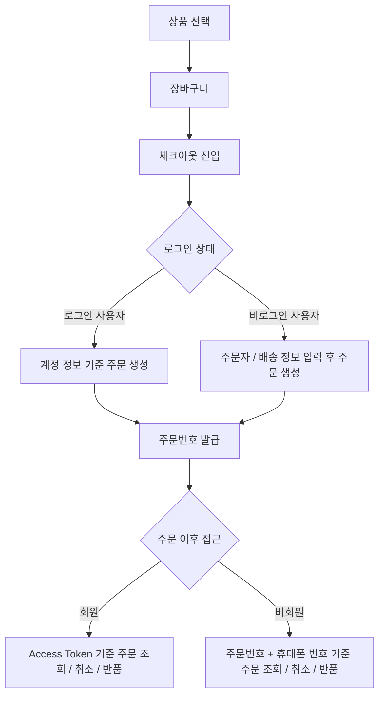

# 🛒 Shopping Frontend

상품 탐색부터 장바구니, 회원/비회원 주문, 마이페이지, 관리자 운영 화면까지 다룬 쇼핑몰 프론트엔드 프로젝트입니다.

NestJS 백엔드 API와 연동되는 구조로 작업했으며, 프론트엔드에서는 주문 생성 전후의 사용자 흐름과 관리자 주문·반품 처리 화면을 중심으로 맡았습니다.

외부 PG 결제와 택배사 API 연동은 제외하고, 무통장 입금과 관리자 배송 처리 방식으로 주문 상태 흐름을 설계했습니다.

## 관련 저장소

| 구분 | 저장소 |
| --- | --- |
| Frontend | `shopping-frontend` |
| Backend | `shopping-backend` |

## 구현 범위

| 범위 | 내용 |
| --- | --- |
| 화면 | 상품 탐색, 장바구니, 체크아웃, 회원/비회원 주문, 마이페이지, QnA/공지/FAQ 화면, 관리자 주문·반품·상품·공지·FAQ 화면 |
| 연동 | JWT Access Token, Refresh Token Cookie, 주문/반품/상품/공지/QnA API 연동 |
| 제외 | 외부 PG 결제 연동, 택배사 배송 API 연동 |

---

## 🧰 Tech Stack

| 구분 | 기술 |
| --- | --- |
| Framework | React |
| Language | JavaScript |
| Routing | React Router |
| API | Axios |
| Styling | Tailwind CSS |
| Auth | JWT Access Token + Refresh Token Cookie |
| State | Context API, localStorage |
| UI | React Icons, React Toastify |
| Test | React Testing Library |
| Performance | web-vitals |
| Build | React Scripts |

---

## ✨ 주요 기능

### 👤 사용자 기능

- 회원가입 / 로그인 / 로그아웃
- 상품 목록 조회
- 상품 상세 조회
- 옵션 선택
- 장바구니
- 선택 결제 / 전체 결제
- 회원 주문 / 비회원 주문
- 비회원 주문 조회
- 비회원 주문 취소 요청
- 비회원 반품 요청
- 체크아웃
- 주문 생성
- 주문 내역 조회
- 반품 요청
- QnA 작성 / 조회
- 공지 / FAQ 조회
- 마이페이지

### 🛠️ 관리자 기능

- 상품 등록 / 수정 / 삭제
- 이미지 업로드
- 주문 목록 조회
- 입금 확인
- 배송 처리
- 반품 승인 / 거절
- 공지 / FAQ 관리

---

## 🖼️ 주요 화면

### 🛍️ 상품 탐색


사용자는 상품 목록에서 상품을 탐색하고, 상세 페이지로 이동할 수 있습니다.

상품 목록 화면에서는 상품 카드, 가격, 상품 정보, 상세 페이지 이동 흐름을 제공합니다.

---

### 🛒 장바구니


장바구니에서는 사용자가 담은 상품의 옵션, 수량, 가격을 확인할 수 있습니다.

장바구니 데이터는 주문 요청 전 단계의 임시 상태이므로, 선택한 옵션 정보와 수량을 주문 payload로 변환하기 쉬운 형태로 저장했습니다.

---

### ✅ 회원 주문 / 체크아웃


로그인 사용자는 계정 정보를 기준으로 주문할 수 있습니다.

체크아웃 화면에서는 장바구니 아이템을 주문 요청 payload로 변환해 서버에 보냅니다.

프론트엔드는 사용자가 선택한 상품과 옵션 정보를 주문 요청 형태로 정리하고, 서버는 옵션 조합과 재고 검증을 최종적으로 담당하는 구조입니다.

---

### 🧾 비회원 주문 / 체크아웃


비로그인 사용자도 주문자 정보와 배송 정보를 입력해 주문할 수 있도록 회원 주문과 비회원 주문 흐름을 나눴습니다.

주문 생성 이후에는 주문번호와 휴대폰 번호를 기준으로 주문 상세 조회, 취소 요청, 반품 요청까지 이어지는 흐름입니다.

---

### 📦 관리자 주문 관리


관리자는 주문 목록을 확인하고, 입금 확인과 배송 처리 같은 주문 운영 상태를 관리할 수 있습니다.

주문 관리는 단순 목록 조회보다 상태 변경 흐름이 중요하다고 보고, 입금 확인과 배송 처리 상태가 관리자 화면에서 바로 구분되도록 했습니다.

---

### 🔁 관리자 반품 관리


관리자는 사용자가 요청한 반품 내역을 확인하고, 반품 승인 또는 거절 처리를 할 수 있습니다.

반품은 주문 이후의 운영 흐름이므로, 주문 관리와 별도 탭으로 나눠 처리 대기 상태를 빠르게 확인할 수 있게 했습니다.

---

### 🔐 로그인 모달


인증이 필요한 요청에서 401이 발생하면 전역 인증 이벤트를 발생시키고, 현재 화면 위에 로그인 모달을 띄웁니다.

각 페이지에서 인증 만료 처리를 반복하지 않고 공통 흐름으로 관리하기 위한 구조입니다.

---

### 🧩 관리자 상품 등록 / 수정


관리자는 상품 정보와 이미지를 등록하거나 수정할 수 있습니다.

사용자 화면에 노출되는 상품 정보를 관리자 화면에서 등록, 수정, 삭제할 수 있도록 관리 흐름을 나눴습니다.

---

## 📌 핵심 문제

쇼핑몰은 상품 목록, 장바구니, 주문 생성처럼 사용자에게 익숙한 기본 흐름도 중요하지만, 실제 서비스로 동작하려면 주문 이후의 운영 흐름까지 함께 고려해야 합니다.

특히 비회원 사용자는 로그인 정보가 없기 때문에 주문 이후 조회, 취소 요청, 반품 요청을 어떤 기준으로 허용할지 정해야 했고, 관리자는 주문 상태와 반품 상태를 화면에서 빠르게 확인하고 처리할 수 있어야 했습니다.

그래서 이 프로젝트에서는 **API 요청 구조를 정리하는 것뿐 아니라, 비회원 주문 이후 흐름과 관리자 운영 화면을 끊기지 않게 연결하는 것**을 핵심 문제로 잡았습니다.

---

## 🧱 API 요청 구조

페이지와 컴포넌트에서 직접 Axios를 호출하지 않고, 도메인별 service 함수가 공통 `request()`를 거치도록 나눴습니다.

`request()`는 API 요청의 단일 진입점으로, body/params 전달 방식과 응답 데이터 추출을 담당합니다.

실제 Axios 인스턴스인 `httpClient`는 baseURL, `withCredentials`, Access Token 자동 부착, 401 공통 처리를 담당합니다.



이 구조 덕분에 페이지 코드는 화면 상태와 렌더링에 집중하고, 인증/응답/에러 처리 같은 공통 로직은 API 계층에서 일관되게 다룰 수 있습니다.

---

## 🔐 인증 / 세션 관리

Access Token은 프론트 메모리에만 저장하고, Refresh Token은 HttpOnly Cookie 기준으로 다뤘습니다.

- Access Token: `tokenMemory`
- Refresh Token: HttpOnly Cookie
- 모든 요청은 `withCredentials: true` 기준으로 동작
- 앱 최초 진입 시 Access Token이 없으면 `/auth/refresh`를 1회 시도
- 일반 API 요청 중 401 발생 시 자동 refresh/retry를 수행하지 않음

```text
Access Token → 프론트 메모리
Refresh Token → HttpOnly Cookie
```

Access Token 저장 방식은 `localStorage`와 메모리 저장 방식을 비교해 결정했습니다.

`localStorage`는 새로고침 이후 유지가 쉽지만, XSS 상황에서 노출 위험이 크다고 봤습니다.

그래서 Access Token은 메모리에 두고, Refresh Token은 HttpOnly Cookie로 유지하는 방향을 선택했습니다.

---

## 🚨 401 인증 만료 처리

일반 API 요청 중 401이 발생하면 Access Token을 제거하고, 전역 `AUTH_REQUIRED` 이벤트를 발생시킵니다.

`AuthContext`는 해당 이벤트를 감지해 `authRequired` 상태를 `true`로 변경하고, `HeaderUnified`는 `authRequired` 상태를 감지해 현재 화면 위에 로그인 모달을 표시합니다.



로그인 성공 시에는 사용자 정보를 다시 불러오고, `authRequired` 상태를 `false`로 초기화합니다.

이 방식은 일반 API 요청 중 401이 발생했을 때 자동 refresh/retry가 반복되는 상황을 막기 위한 선택입니다.

무한 재시도나 예측하기 어려운 인증 상태를 줄이고, 사용자에게 로그인 필요 상태를 명확히 안내하는 데 초점을 맞췄습니다.

---

## 🛒 장바구니 로컬 상태 관리

장바구니는 서버 API 대신 localStorage 기반 로컬 상태로 다뤘습니다.

- 로그인 사용자: `cart_{username}`
- 비로그인 사용자: `cart_guest`
- 동일 상품이라도 옵션 조합이 다르면 별도 라인으로 저장

```text
12
12|color=black&size=M
```

장바구니는 주문 생성 전 사용자가 선택한 상품과 옵션을 임시로 보관하는 영역입니다.

서버 주문이 생성되기 전까지는 localStorage에 보관하고, 체크아웃 단계에서 주문 payload로 변환합니다.

---

## 🧾 회원 / 비회원 주문 흐름

장바구니 아이템은 주문 payload로 변환해 서버에 보냅니다.

로그인 사용자는 계정 정보를 기준으로 주문하고, 비로그인 사용자는 체크아웃 화면에서 입력한 주문자 정보와 배송 정보를 기준으로 주문하는 흐름입니다.

주문 생성 이후에도 회원과 비회원의 접근 방식이 다릅니다.

- 로그인 사용자: Access Token 기준으로 본인 주문 조회 / 취소 요청 / 반품 요청
- 비로그인 사용자: 주문번호와 주문 시 입력한 휴대폰 번호 기준으로 주문 조회 / 취소 요청 / 반품 요청
- `optionId`, `variantId`는 프론트에서 보내지 않음
- `optionValues` 기준으로 주문 생성
- 서버가 옵션 조합과 재고를 검증

```json
{
  "items": [
    {
      "productId": 1,
      "qty": 2,
      "optionValues": {
        "size": "M",
        "color": "black"
      }
    }
  ]
}
```



프론트엔드는 사용자가 선택한 상품, 옵션, 수량을 주문 요청 형태로 정리하고, 서버는 실제 옵션 조합과 재고 가능 여부를 검증합니다.

비회원 주문은 로그인 상태가 없어도 주문번호와 휴대폰 번호를 기준으로 주문 상세를 확인하고, 주문 상태에 따라 취소 요청 또는 반품 요청으로 이어질 수 있습니다.

---

## 🛠️ 관리자 운영 흐름

사용자 화면은 일반적인 쇼핑몰 구매 흐름에 맞추고, 관리자 화면은 주문 상태 변경과 반품 처리처럼 운영자가 반복적으로 확인해야 하는 흐름에 맞췄습니다.

- 상품 등록 / 수정
- 이미지 업로드
- 주문 목록 조회
- 입금 확인
- 배송 처리
- 반품 승인 / 거절


관리자 화면에서는 단순 CRUD보다 운영자가 현재 상태를 빠르게 파악하고 처리할 수 있는 흐름이 더 중요하다고 봤습니다.

그래서 주문 관리와 반품 관리를 나누고, 상태 확인과 처리 버튼이 운영 흐름에 맞게 보이도록 배치했습니다.

---

## 🧪 Troubleshooting / Lessons Learned

### 1. 화면 먼저 구현했을 때 API 연동 문제가 커지는 문제

| 항목 | 내용 |
| --- | --- |
| Problem | API endpoint, JSON 응답 형식, 인증 방식, 주문 payload가 명확하지 않은 상태에서 화면 구현을 먼저 진행해 실제 연동 단계에서 데이터 구조가 맞지 않았습니다. |
| Cause | 프론트엔드와 백엔드가 기대하는 요청/응답 형식, 인증 흐름, 주문 payload 기준이 달랐습니다. |
| Fix | `service → request → httpClient` 구조로 API 요청 계층을 분리하고, 인증/에러 처리 책임을 공통화했습니다. |
| Result | 화면 코드는 렌더링과 사용자 액션에 집중하고, API 요청/인증/응답 처리는 공통 계층에서 관리할 수 있게 되었습니다. |

### 2. 비회원 주문 흐름을 추가하며 주문 접근 기준이 모호해지는 문제

| 항목 | 내용 |
| --- | --- |
| Problem | 로그인 사용자와 비로그인 사용자의 주문 흐름이 달라, 주문 생성 이후 조회/취소/반품 요청을 어떤 기준으로 허용해야 하는지 기준이 필요했습니다. |
| Cause | 로그인 사용자는 Access Token으로 본인 여부를 확인할 수 있지만, 비로그인 사용자는 계정 정보가 없기 때문에 주문 이후 접근 권한을 확인할 다른 기준이 필요했습니다. |
| Fix | 로그인 사용자는 Access Token 기준으로 본인 주문에 접근하고, 비로그인 사용자는 주문번호와 주문 시 입력한 휴대폰 번호를 기준으로 주문 조회/취소/반품 요청을 처리하도록 분리했습니다. |
| Result | 로그인하지 않은 사용자도 주문 이후 주문번호와 휴대폰 번호를 통해 주문을 확인하고, 상태 조건에 따라 취소 요청이나 반품 요청까지 이어갈 수 있게 되었습니다. |

---

## 📁 프로젝트 구조

```text
src
├─ app
├─ shared
│  └─ api
├─ features
│  ├─ auth
│  ├─ catalog
│  ├─ cart
│  ├─ checkout
│  ├─ mypage
│  ├─ qna
│  └─ admin
└─ ui
   └─ components
```

```text
docs
└─ screens
   ├─ product-list.png
   ├─ cart.png
   ├─ checkout.png
   ├─ guest-checkout.png
   ├─ admin-orders.png
   ├─ admin-returns.png
   ├─ login-modal.png
   └─ admin-product-form.png
```

---

## 🔧 환경 변수

`.env.example`을 참고해 `.env` 파일을 생성합니다.

```env
REACT_APP_API_BASE=http://localhost:8080
REACT_APP_API_PREFIX=/api/v1
```

| 변수 | 설명 |
| --- | --- |
| `REACT_APP_API_BASE` | 백엔드 API 서버 주소 |
| `REACT_APP_API_PREFIX` | 백엔드 전역 API prefix |

로컬 기준 백엔드 서버가 `http://localhost:8080`에서 실행되고, 백엔드 전역 prefix가 `/api/v1`로 설정되어 있어 프론트엔드는 기본적으로 `http://localhost:8080/api/v1`로 요청을 보냅니다.

---

## 🚀 실행 방법

```bash
npm install
npm start
```

백엔드와 함께 확인하려면 `shopping-backend`를 먼저 실행한 뒤 프론트엔드를 실행합니다.

```bash
# shopping-backend
npm install
npm run start:dev

# shopping-frontend
npm install
npm start
```

---

## 📦 Build

```bash
npm run build
```

---

## 🧪 Test

```bash
npm test
```

테스트 실행 환경은 React Testing Library 기반으로 구성되어 있습니다.
